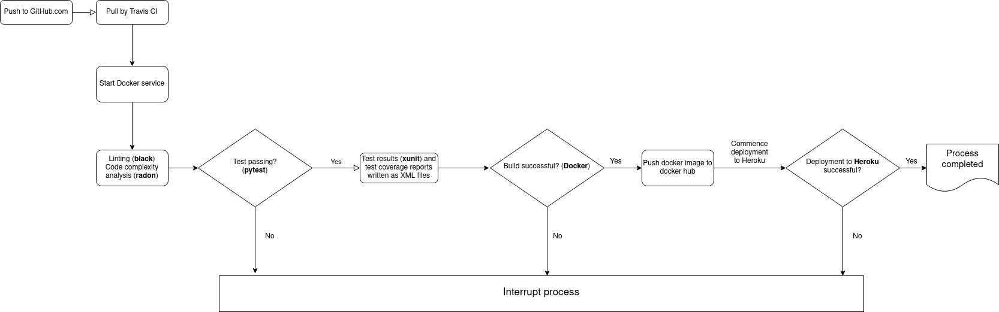

# Hello World Printer
## Opis procesu CI/CD

Hello World Printer ("HWP") jest aplikacją tworzoną i utrzymywaną zgodnie z praktykami Continuous Integration / Continuous. Ten dokument opisuje proces, stosowane testy oraz wykorzystywane narzędzia.

W celu usprawnienia procesów, instrukcje do wykonania na poszczególnych etapach procesu zostały zebrane do pliku _Makefile_.

1. ### GitHub
Kod aplikacji przechowywany jest w repozytorium na www.github.com. Proces CI/CD uruchamiany jest automatycznie w przypadku wgrania ("push") zmian do gałęzi "master". __Proces nie jest uruchamiany przez pull requests__. Do repozytorium automatyczny dostęp posiada aplikacia Travis CI, która po wykryciu nowego commitu uruchamia proces testowania kodu i budowania aplikacji.

Z kontroli wersji wyłączone są elementy wskazane w pliku _.gitignore_.

.

2. ### Travis CI
Po wykryciu nowego commitu w repozytorium (na branchu "master"), Travis CI (www.travis-ci.com) rozpoczyna proces CI/CD zgodnie z instrukcjami zawartymi w pliku _.travis.yml_. Dane wrażliwe (Docker password, Heroku api key) przechowywane są w samej aplikajci Travis CI i przekazywane do procesu w formie zmiennych środowiskowych.

- uruchomiona zostaje maszyna wirtualna z Pythonem w wersji 3.6
- przygotowana zostaje usługa Docker
- zostają zainstalowane biblioteki wskazane w plikach _requirements.txt_ oraz *test_requirements.txt* (instrukcja "make deps" z _Makefile_)
- przeprowadzony zostaje linting kodu za pomocą biblioteki __black__, a także analiza złożoności kodu ("code complexity") za pomocą biblioteki **radon**. Wynik analizy złożoności zostaje wyświetlony i zapisany w logach Travis CI, ale nie ma wpływu na dopuszczenie do dalszych etapów procesu
- przeprowadzone zostają testy jednostkowe za pomocą biblioteki **pytest**:
    - test funkcji "uppercase"
    - test zwracania outputu w formacie XML
    - test zwracania outputu w formacie JSON
    - test poprawności wyświetlania wspieranych formatów
- zapisane w formacie XML zostają wyniki testów (z ewentualnymi ostrzeżeniami) oraz wynik analizy pokrycia aplikacji testami (test coverage)
#### Docker
- po pozytywnym wyniku testów, Travis uruchamia instrukcję make docker_build, tworzącą kontener Dockera zawierający HWP.
    - po utworzeniu, obraz Dockera push'owany jest do serwisu hub.docker.com (na podstawie loginu zapisanego w kodzie aplikacji oraz hasła zapisanego jako zmienna środowiskowa w Travis CI)
    - uruchomiony zostaje proces deployment'u do platformy Heroku

#### Deployment do Heroku
- Kontener zawierający HWP wykorzystywany jest do deploymentu aplikacji w serwisie __heroku.com__, pod adresem https://immense-fjord-21653.herokuapp.com.
- Deployment odbywa się w pełni automatycznie poprzez API. Dodatkowe instrukcje przekazywane przez Travis CI do Heroku zawarte są w pliku _Procfile_. Klucz uwierzytelniający do API Heroku ("HEROKU API KEY") przechowywany jest jako zmienna środowiskowa w Travis CI.

3. ### Zakończenie procesu
W przypadku pomyślnego zakończenia całego procesu, build otrzymuje w Travis CI status "passing". Aktualny status aplikacji to: 

4. ### Monitoring
Monitoring działania aplikacji prowadzony jest za pomocą serwisu **statuscake.com**.

Serwis monitoruje aktywność aplikacji poprzez wysyłanie ping'ów w 15-minutowych odstępach z losowych lokalizacji na świecie. W przypadku powtarzającego się braku odpowiedzi na pinga (tj. braku odpowiedzi na pierwotne zapytanie oraz na follow-up z innej lokalizacji) serwis wysyła powiadomienie e-mailowe do zespołu Rapid Response. 

5. ### Możliwość zastosowania alternatywnych narzędzi CI/CD
Travis CI został wybrany jako preferowane narzędzie CI/CD dla HWP po przetestowaniu również:
    - Gitlab CI
    - Jenkins'a

Pliki konfiguracyjne _.gitlab-ci.yml_ oraz _Jenkinsfile_ zostały zachowane w repozytorium w celu ewentualnego ponownego wykorzystania w przyszłości. **Pliki te nie są aktualizowane i nie odzwierciedlają ustawień zawartych w _.travis.yml_**.

6. ### Kontakt
W przypadku pytań lub wątpliwości, osobą odpowiedzialną za proces CI/CD oraz dokumentację jest M.K., dostępny pod adresem pv313@student.wsb.warszawa.pl. 